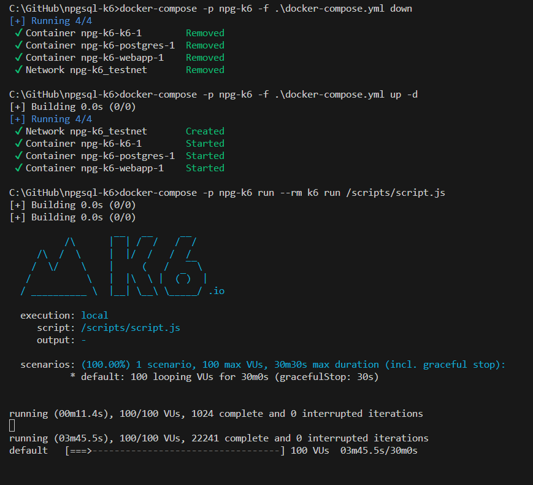
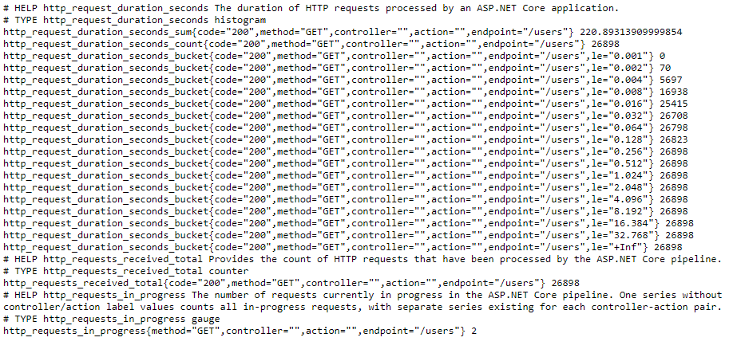

# Sample of ASP.NET Core Web API load testing

It runs in containers:
- ASP.NET Core Web API getting data from PostgreSQL
- PostgreSQL with one table populated by script (sql/init.sql)
- k6 load script calling Web API (load/script.js)

## How to build and run

Build Web API image:
```
build.cmd
```

Run load tests:
```
run.cmd
```

## How to monitor execution

- Check out the console output, it should look like this:


- Open a browser and check http://localhost:5005/metrics endpoint, it provides prometheus metrics:
